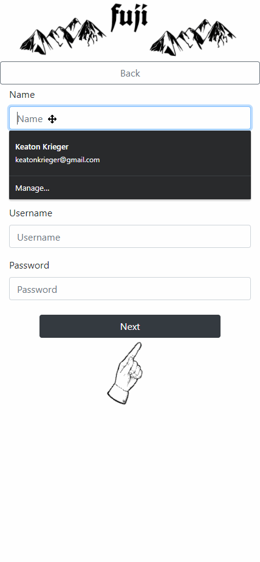

# Fuji 
---
 A sandbox image sharing application that gives users creative freedom with there content

## live Demo
>[dev.fuji.social](https://dev.fuji.social/)

## Technologies Used
---
- React.Js
- Node.Js
- Express
- Postgresql
- AWS EC2
- Postgresql
## Dependencies Used
---
- React Slick
- Slick-carousel
- Konva.Js
- React Avatar Editor
- React Rounded Image
- React Switch
- React Color
## Features
---
- Users can sign-up
- Users can login
- Users can post Pictures or videos
- Users can comment on others posts via sketchpad
- Users can follow other users
- Users can change profile picture

## Preview
---
>Sign-up

> ---
>Login

> ---
>User can post images

> ---
>User can comment on posts with images

> ---
>User can follow other users

> ---
>User can change profile picture

> 

